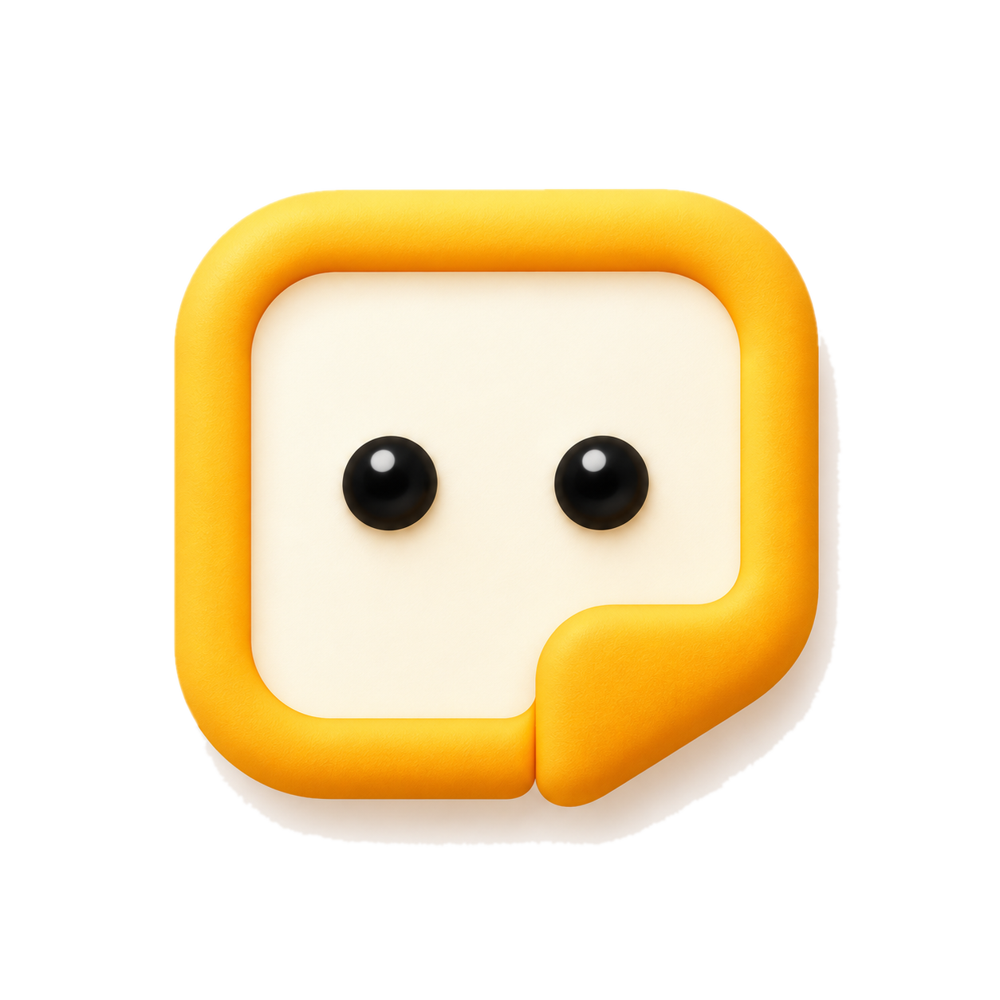
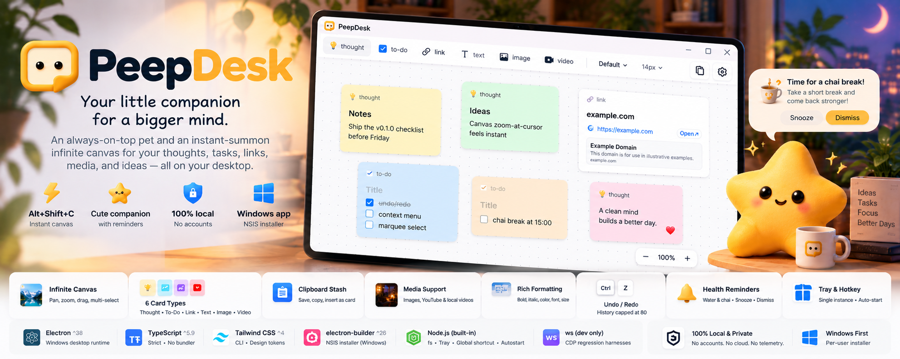
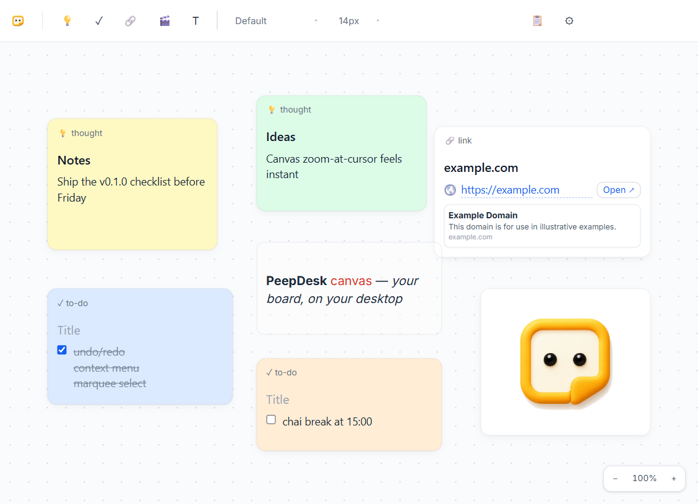

<div align="center">



# PeepDesk

*Your little companion for a bigger mind.*

[](https://github.com/MAhsaanUllah/PeepDesk)
[](#windows-installation)
[](https://www.electronjs.org)
[](https://www.typescriptlang.org)
[](LICENSE)
[](#data--privacy)

</div>

PeepDesk is an ultra-lightweight Windows desktop companion: a floating animated mascot, hydration and chai-break reminders, and an instant-summon infinite whiteboard canvas — one small Electron app, all data stored locally.



## Screenshots (real app)

The infinite canvas with thought, to-do, link (auto-preview), rich-text and image cards, top toolbar and zoom pill:



Fluffy Star, the always-on-top desktop pet that delivers the reminders:


### Fluffy Star's moods

The pet reacts to your reminders — idle on the desktop, focused when it's time to hydrate, sleepy at chai-break alerts, and celebrating when you respond to one (plus a spare happy pose in the collection):

<table>
<tr>
<td align="center"><br/><b>Idle</b></td>
<td align="center"><br/><b>Happy</b></td>
<td align="center"><br/><b>Focus</b></td>
<td align="center"><br/><b>Sleepy</b></td>
<td align="center"><br/><b>Success</b></td>
</tr>
</table>

## Features

- **Desktop pet (Fluffy Star)** — always-on-top overlay with idle/alert animations and a speech bubble; hides to the system tray.
- **Health reminders** — water alert every N minutes and a "chai" break alert that only fires inside a configurable time window; snooze/dismiss from the bubble; intervals and window editable in canvas ⚙ settings.
- **Infinite canvas** — dot-grid board with pan (drag) and zoom-to-cursor (wheel, 25–300%).
- **Card types** — Thought, To-Do (checkboxes), Link (auto title/description/favicon preview), Text (free text box), Image (drop/paste), Video (YouTube links or dropped local files).
- **Rich formatting** — bold/italic/underline/text color on selected cards, per-card font family and size from the toolbar.
- **Pro editing** — undo/redo (one entry per complete gesture), duplicate, delete, z-order, per-type context menu, multi-select (Ctrl/Cmd+click), group drag, Shift+drag marquee selection.
- **Clipboard stash** — save, copy, and insert clipboard snippets without leaving the canvas.
- **Local persistence** — board and imported media are saved to disk with debounced atomic writes; survives restarts and app updates.
- **Single taskbar presence, tray companion, global hotkey, auto-start on login.**

## Keyboard shortcuts

| Shortcut | Action |
|---|---|
| `Alt+Shift+C` (global) | Show/hide the canvas from anywhere |
| `Ctrl/Cmd+Z` | Undo |
| `Ctrl/Cmd+Shift+Z` / `Ctrl+Y` | Redo |
| `Ctrl/Cmd+D` | Duplicate selected card(s) |
| `Delete` / `Backspace` | Delete selected card(s) (safe while typing) |
| `Escape` | Clear selection / close menus |
| `Shift+drag` | Marquee multi-select (plain drag pans) |

## Windows installation

1. Download `PeepDesk-Setup-0.1.0.exe`.
2. Run it — a per-user silent install; no administrator rights required. The app installs to `%LOCALAPPDATA%\Programs\peepdesk` and adds a **PeepDesk** Start Menu shortcut.
3. Launch **PeepDesk** from the Start Menu; it also starts automatically on login from then on.

PeepDesk v0.1.0 is currently distributed as an unsigned Windows portfolio build, so Windows SmartScreen may show an unrecognized publisher warning. Choose "More info" → "Run anyway" if you trust the source of the download; you can leave Defender and SmartScreen enabled.

## Data & privacy

- The board is stored locally in `%APPDATA%\PeepDesk\peepdesk-state.json`, with imported media in `%APPDATA%\PeepDesk\media\`. Installs upgrading from the legacy `NekoBoard` folder name migrate automatically on first launch.
- **Uninstalling does not delete your boards or media.**
- No accounts, no cloud sync, no analytics, no telemetry. The only network activity is fetching things you explicitly ask for: Google Fonts (typography), favicons/link previews for URLs you paste, and YouTube embeds you add.
- Alternate profile for testing/portability: `PeepDesk.exe --user-data-dir="D:\my-board"` runs a fully separate instance (different profiles can run side by side).

## Development

```bash
npm install
npm run dev      # compile main + renderer + CSS, then launch Electron
npm run watch    # recompile the main process on change
```

Stack: Electron + strict TypeScript, no UI framework. Renderers are vanilla TS with a Tailwind-generated stylesheet; persistence is debounced `fs` writes with tmp+rename in the main process. Verification harnesses (CDP regression suites, stress and metrics scripts) live in `logs/`.

## Build

```bash
npm run dist     # full build + electron-builder → release/PeepDesk-Setup-<version>.exe (NSIS, x64)
```

The installer is intentionally unsigned for the portfolio release (SmartScreen warning expected). There is no auto-update; upgrading means running the newer Setup file, which replaces the old install and keeps your data.

## Known limitations

- Unsigned installer; no automatic updates.
- Undo history is in-memory and resets when the app restarts.
- Exact viewport pan/zoom position is not persisted between sessions.
- Memory footprint is the Electron/Chromium multi-process baseline (~250–300 MB working set), not a native-app floor.
- Windows-only build; multi-monitor and extended soak behavior not fully verified.
